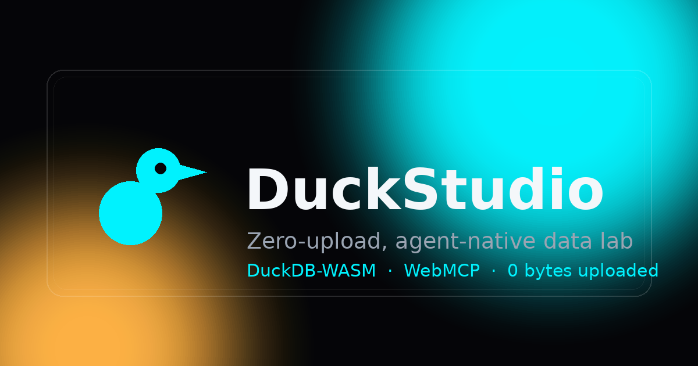
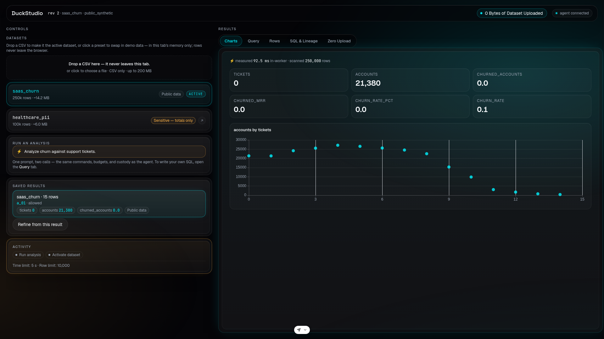
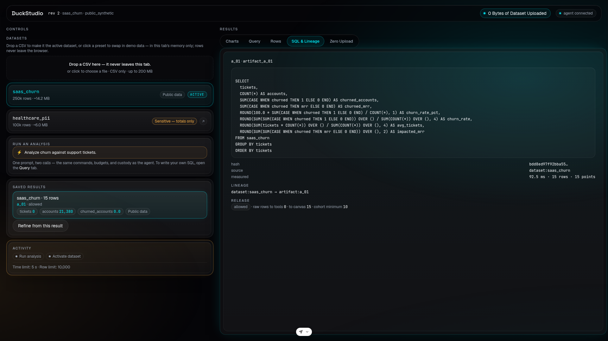

<div align="center">



[](https://github.com/abodacs/DuckStudio/actions/workflows/ci.yml)
[](./LICENSE)


**Analyze local data with DuckDB-WASM. Let an AI agent operate the lab without receiving result rows — or custody of the file.**

DuckDB-WASM analyzes local data inside a browser worker while WebMCP lets an agent operate a governed workspace. The core idea is **controlled release**: a browser agent can observe both tool payloads and the page, so one custody policy governs what may enter either surface.

[Quick start](#quick-start) · [Connect an agent](#connect-a-browser-agent) · [WebMCP tools](#webmcp-tools) · [Documentation](#documentation)



*One screen, two panes: controls and agent context on the left; measured evidence on the right — KPI tiles, the lazy ECharts boundary, the virtualized grid, and captured custody evidence.*

</div>

## Why DuckStudio

- **Zero upload, proven live.** The header badge reads `0 Bytes of Dataset Uploaded` — kept honest by egress interception across `fetch`, `XMLHttpRequest`, `sendBeacon`, `WebSocket`, and `WebTransport`. Datasets live in this tab's memory only.
- **Agent-native, not agent-tolerated.** Four WebMCP tools expose the same domain commands the human UI dispatches. The agent receives safe metadata, aggregate releases, stable artifact handles, and operation evidence — never raw rows.
- **A real analytical engine.** DuckDB-WASM runs in an isolated Web Worker: bounded, read-only SQL over 250k-row presets, measured in milliseconds, entirely client-side.
- **Every call compounds.** Each successful analysis lands as an immutable artifact carrying its SQL, schema, lineage, policy release, and measured runtime. Refinements source a prior artifact instead of recomputing.

> **Status:** all slices of the one-day build are implemented; deploy and audit gates run in CI. The slice tracker in [`docs/prd.md`](./docs/prd.md) §9 is canonical. Submission pack: [`docs/submission.md`](./docs/submission.md).

## Inside the workspace

**Charts** — measured KPIs and the churn scatter, computed in-worker and painted client-side (the hero image above). **SQL & Lineage** — every artifact carries its SQL, hash, lineage, and the exact policy release.



## Quick start

Prerequisites are defined and enforced: **Node 26** (`.nvmrc`, `engines.node`, pnpm `engineStrict`) and **pnpm 11.25.0** (pinned via `packageManager`).

```bash
pnpm install
pnpm duckdb:download   # one-time: fetch gitignored DuckDB-WASM assets; required before the first build
pnpm dev               # dev server on http://localhost:5173
```

<details>
<summary><strong>All scripts and tooling notes</strong></summary>

```bash
pnpm lint               # oxlint over the repo; --deny-warnings: any warning fails
pnpm lint:strict        # the nine trust-seam files, raised rules, --deny-warnings
pnpm typecheck          # tsc --noEmit
pnpm test               # vitest (CI mode)
pnpm build              # static dist/ (public/_headers ships with it)
pnpm build && pnpm e2e  # Playwright serves dist/ via wrangler pages dev on port 8787
```

Warning levels are controlled, not floating: `pnpm lint` denies warnings repo-wide, and `.oxlintrc.json` raises the trust-seam rules (`no-explicit-any`, `no-non-null-assertion`, `no-console`) to errors in eight of the nine trust-seam files. A warning is either fixed or explicitly configured away — never accumulated.

E2E launches Chrome with `--enable-features=WebMCPTesting --enable-experimental-web-platform-features`, so the native registration path is exercised headlessly.

Never commit to `main` — work on a feature branch and open a PR with [`.github/PULL_REQUEST_TEMPLATE.md`](./.github/PULL_REQUEST_TEMPLATE.md). Workflow rules: [`AGENTS.md`](./AGENTS.md). Tests, checks, and the pre-publish audit: [`CONTRIBUTING.md`](./CONTRIBUTING.md).

</details>

## Connect a browser agent

WebMCP requires **Chromium `146.0.7672.0` or higher** with the `#enable-webmcp-testing` flag, and tools register only in a secure context — HTTPS or `localhost`; on a LAN IP they do not register. Full setup steps (remote debugging, flag, reload): [`CONTRIBUTING.md`](./CONTRIBUTING.md).

When `document.modelContext` is absent, the built-in **Agent Simulator** takes over — same workspace, same operations; only the language model is simulated.

## WebMCP tools

| Tool                           | Purpose                                                                                    |
| ------------------------------ | ------------------------------------------------------------------------------------------ |
| `duckdb_get_context`           | Bootstrap or delta-read the actionable workspace state.                                    |
| `duckdb_activate_dataset`      | Activate an already local preset with revision and idempotency control.                    |
| `duckdb_execute_sql_to_canvas` | Run one bounded read-only analysis, create an artifact, infer presentation, and select it. |
| `duckdb_verify_zero_egress`    | Read scoped upload, release, transport, policy, and lineage evidence.                      |

All four tools are imperative — the page exposes no declarative form tools. Tool contracts, envelopes, and agent playbooks: [`docs/agent-system-design.md`](./docs/agent-system-design.md) §8 and §12. The pinned registration-API facts: [`CONTRIBUTING.md`](./CONTRIBUTING.md).

<details>
<summary><strong>How tools register</strong></summary>

One imperative registration path with a module-owned `AbortController` (`src/agent-control-plane/registration.ts`):

```ts
const registry = nativeAvailable ? document.modelContext : undefined;
if (registry && "registerTool" in registry) {
  const tools = buildTools(store);
  for (const tool of tools) {
    await registry.registerTool(tool, {
      signal: registrationAbortController.signal,
    });
  }
}
```

Unregistering means aborting `registrationAbortController` — there is no `unregisterTool()`. A cross-origin iframe embedding the app must include `allow="tools"` in its Permissions Policy.

</details>

## Demo presets

Two synthetic presets are generated in browser memory and activated by ID. You can also bring your own file: drop a CSV (≤200 MB, ≤5,000 columns) onto the Datasets card and it imports as the active dataset under the sensitive-by-default policy — in this tab's memory only, never uploaded. Pinned numbers, policies, and demo order: [`docs/prd.md`](./docs/prd.md) §6.

| Preset           | Rows                        | Policy                                                |
| ---------------- | --------------------------- | ----------------------------------------------------- |
| `saas_churn`     | 250,000 (~14.2 MB), public  | `public_synthetic` — row display permitted on artifacts |
| `healthcare_pii` | 100,000, sensitive          | `sensitive_aggregate_only` — aggregates only, cohorts below 10 suppressed |

## Guardrails

- **Bounded work** — a 5,000 ms execution deadline, a 10,000-row result cursor, 2,000 chart points, 8 KB tool summaries, and 20 retained artifacts, enforced inside the worker.
- **Read-only SQL only** — one `SELECT`/`WITH` statement with parameter bindings. DDL, DML, transactions, `ATTACH`, `COPY`, exports, URLs, and external scans are rejected. Deny list: [`docs/agent-system-design.md`](./docs/agent-system-design.md) §6.
- **Deterministic control** — mutations require `expectedRevision` and an idempotency key; retries are safe; failures carry stable error codes and legal next actions.
- **Honest evidence** — the badge claims zero dataset upload bytes, nothing more. Runtime telemetry is operational evidence, not a formal proof.

## Platform boundaries

- **Single-threaded by configuration** — only the self-hosted `eh` and `mvp` DuckDB-WASM bundles ship, no `coi`/pthread bundle, so `selectBundle` returns `eh` and queries run on one thread. The shipped COOP/COEP isolation exists for the document, not for DuckDB threading.
- **WebAssembly memory ceiling** — the browser's wasm memory limit (4 GB, sometimes lower per browser) applies unmanaged; the effective query limit is the custody-clamped budget enforced inside the worker.
- **No remote reads** — the SQL inspector rejects external URLs/files, so there are no range-request reads of remote files; the only sources are the two registered presets and locally imported CSV relations (drop-and-import, in-tab only — never URLs).

Engine lifecycle and the custody → engine seam: [`ARCHITECTURE.md`](./ARCHITECTURE.md).

## Stack

Vite, React, TypeScript, Tailwind CSS, and `@tanstack/react-router`, with `@duckdb/duckdb-wasm` in a Web Worker, ECharts behind a lazy boundary in `src/live-canvas/chart.tsx`, and self-hosted fonts. Full stack and platform rationale: [`PRODUCT.md`](./PRODUCT.md).

## Deploy (Cloudflare Pages)

Every push to `main` deploys from CI: after the quality and E2E jobs are green, the deploy job builds and runs `wrangler pages deploy dist --project-name duckstudio --branch main`, authenticated with the `CLOUDFLARE_API_TOKEN` / `CLOUDFLARE_ACCOUNT_ID` repo secrets. Deploys ship the static `dist/` and inherit `public/_headers` (COOP/COEP/CORP) at the edge.

Preview deploys for a feature branch are manual:

```bash
pnpm exec wrangler pages deploy dist --project-name duckstudio
```

## Documentation

Each fact lives in one canonical document; the others derive from it.

| Document                                                                        | Owns                                                              |
| ------------------------------------------------------------------------------- | ----------------------------------------------------------------- |
| [`PRODUCT.md`](./PRODUCT.md)                                                    | Product purpose, positioning, principles, non-negotiable invariants |
| [`docs/agent-system-design.md`](./docs/agent-system-design.md)                   | Tool schemas, state mechanics, policy rules, envelopes, errors, agent playbooks |
| [`docs/prd.md`](./docs/prd.md)                                                   | One-day scope, implementation slices, UI behavior, acceptance criteria |
| [`CONTEXT.md`](./CONTEXT.md)                                                     | Shared language                                                    |
| [`ARCHITECTURE.md`](./ARCHITECTURE.md)                                           | Folder structure, command path, state rules, module lifecycle      |
| [`SECURITY.md`](./SECURITY.md)                                                   | Custody and safe-release rules                                     |
| [`CONTRIBUTING.md`](./CONTRIBUTING.md)                                           | Tests, checks, the pre-publish audit, browser setup                |
| [`docs/video-script.md`](./docs/video-script.md)                                 | Demo contract (derived from the PRD)                               |
| [`docs/adr/`](./docs/adr)                                                        | Decision records                                                   |
| [`AGENTS.md`](./AGENTS.md)                                                       | Agent behavior and document authority                              |

## Resources

- [WebMCP proposal and specification](https://github.com/webmachinelearning/webmcp)
- [Chrome WebMCP imperative API](https://developer.chrome.com/docs/ai/webmcp/imperative-api)
- [Chrome WebMCP declarative API](https://developer.chrome.com/docs/ai/webmcp/declarative-api)
- [React on Cloudflare Workers](https://developers.cloudflare.com/workers/framework-guides/web-apps/react/)

## License

[MIT](./LICENSE).
