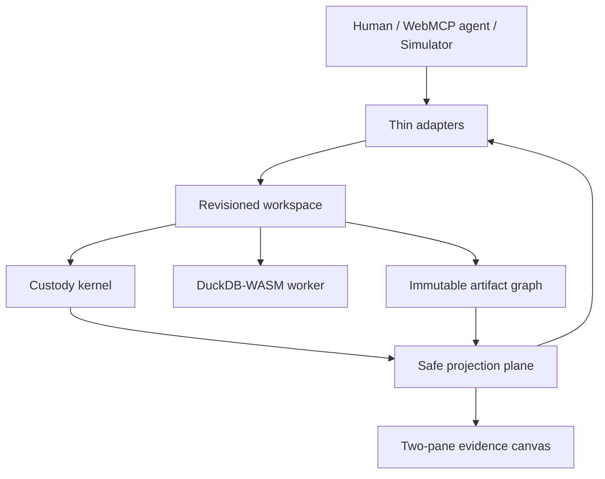

# DuckStudio

DuckStudio is an agent-native, zero-upload data lab. DuckDB-WASM analyzes local data inside a browser worker while WebMCP lets an agent operate a governed workspace without receiving result rows or taking custody of the file.

The core idea is **controlled release**, not locality alone. A browser agent can observe both tool payloads and the page, so one custody policy governs what may enter either surface.

## Status

Slice 1 (walking skeleton) is complete: `duckdb_get_context` is exposed through the WebMCP trust seam and envelope, the shell renders at `rev 0` behind COOP/COEP/CORP isolation, and every push to `main` deploys from CI. The domain systems still ahead — dataset custody, DuckDB engine, artifact graph, the remaining workspace commands and tools — land slice by slice (see [`docs/prd.md`](./docs/prd.md) §9).

- Product intent: [`PRODUCT.md`](./PRODUCT.md)
- Agent and protocol design: [`docs/agent-system-design.md`](./docs/agent-system-design.md)
- Build scope and acceptance: [`docs/prd.md`](./docs/prd.md)
- Demo contract: [`docs/video-script.md`](./docs/video-script.md)
- Implementation architecture: [`ARCHITECTURE.md`](./ARCHITECTURE.md)
- Custody and safe release: [`SECURITY.md`](./SECURITY.md)
- Workflow, tests, audit, browser setup: [`CONTRIBUTING.md`](./CONTRIBUTING.md)
- Agent behavior: [`AGENTS.md`](./AGENTS.md)

## How It Works



1. The agent reads a compact workspace snapshot containing stable IDs, revision, policy, schema digest, budgets, and legal next actions.
2. One bounded command validates SQL and release policy, executes locally, creates an immutable artifact, infers a safe presentation, and selects that artifact atomically.
3. The response contains a projected KPI/chart summary, measured metrics, and artifact handle—never rows.
4. Later analysis may use that artifact as a source, preserving lineage and avoiding repeated work.
5. Custody evidence reports dataset-upload and sensitive-release counters with explicit limitations.

## WebMCP Tools

| Tool | Purpose |
|---|---|
| `duckdb_get_context` | Bootstrap or delta-read the actionable workspace state. |
| `duckdb_activate_dataset` | Activate an already local preset with revision and idempotency control. |
| `duckdb_execute_sql_to_canvas` | Run one bounded read-only analysis, create an artifact, infer presentation, and select it. |
| `duckdb_verify_zero_egress` | Read scoped upload, release, transport, policy, and lineage evidence. |

All tools use one schema module plus runtime validation and one discriminated response envelope. Mutations require `expectedRevision` and `idempotencyKey`; reads support bounded detail and revision deltas. Human and simulator adapters also dispatch `selectArtifact` and `cancelActiveOperation`.

## Minimal Agent Workflow

```text
1. duckdb_get_context({ scope: "summary" })
2. duckdb_execute_sql_to_canvas({
     source: { kind: "dataset", id: "saas_churn" },
     sql: "SELECT ...",
     bindings: {},
     expectedRevision: 1,
     idempotencyKey: "analysis-churn-001"
   })
3. Reuse the returned artifact ID for refinements.
4. Call duckdb_verify_zero_egress only when evidence is needed.
```

Good requests describe the analytical goal and constraints, for example:

> Using the active dataset, compare the target rate by support-ticket count. Stay within the advertised default budget and use the resulting artifact for follow-up analysis.

The agent should use IDs and revisions returned by tools. It should not infer active state from the visible tab or request raw rows.

## Safe-Release Policies

| Policy | Tool rows | Shared grid | Aggregates |
|---|---:|---:|---|
| `public_synthetic` | Never | Bounded rows allowed | Allowed |
| `sensitive_aggregate_only` | Never | Suppressed | Allowed only when every cohort has at least 10 records |

Direct-identifier values are never released. Sensitive bindings are redacted in projected lineage. The one-day build enforces explicit preset policies, SQL restrictions, minimum cohorts, and DOM suppression; it does not claim differential privacy, formal non-interference, SOC 2, or regulatory certification.

The header badge reads `0 Bytes of Dataset Uploaded`. Application-shell traffic is outside that accounting, and runtime interception is operational evidence rather than a formal proof.

## Demo Presets

- `saas_churn`: 250,000 public synthetic rows and a seeded churn-vs-tickets analysis.
- `healthcare_pii`: 100,000 sensitive synthetic rows with omitted direct identifiers and an aggregate-only release policy.

Both datasets are generated in browser memory. No customer data, testimonials, deployed benchmark, or production compliance claim is implied.

## Planned Stack

- Vite, React, TypeScript, Tailwind CSS
- `@duckdb/duckdb-wasm` in a Web Worker
- ECharts
- Self-hosted Inter, Space Grotesk, and JetBrains Mono
- Cloudflare Pages static deployment with COOP/COEP headers
- MIT license

## Local Development

Prerequisites, both defined and enforced:

- **Node 26** — `.nvmrc` (`nvm use` selects it), `engines.node` in `package.json`, and pnpm's `engineStrict` fail the install on any other major.
- **pnpm 11.25.0** — pinned via `packageManager`; corepack (or pnpm ≥ 10.17's own manager) switches to it automatically.

```bash
pnpm install
pnpm dev                # dev server
pnpm lint               # oxlint over the repo; --deny-warnings: any warning fails
pnpm lint:strict        # the four trust-seam files, raised rules, --deny-warnings
pnpm typecheck          # tsc --noEmit
pnpm test               # vitest (CI mode)
pnpm build              # static dist/ (public/_headers ships with it)
pnpm build && pnpm e2e  # Playwright serves dist/ via wrangler pages dev
```

Warning levels are controlled, not floating: `pnpm lint` denies warnings repo-wide, and `.oxlintrc.json` raises the trust-seam rules (`no-explicit-any`, `no-non-null-assertion`, `no-console`) to errors in the four contract files. A warning is either fixed or explicitly configured away — never accumulated.

## Deploy (Cloudflare Pages)

The Pages project was created once with `--production-branch main`. Every push to `main` deploys from CI: after the quality and E2E jobs are green, the deploy job builds and runs `wrangler pages deploy dist --project-name duckstudio --branch main`, authenticated with the `CLOUDFLARE_API_TOKEN` / `CLOUDFLARE_ACCOUNT_ID` repo secrets. Deploys ship the static `dist/` and inherit `public/_headers` (COOP/COEP/CORP) at the edge.

Preview deploys for a feature branch are manual:

```bash
pnpm exec wrangler pages deploy dist --project-name duckstudio
```

## Connect a Browser Agent

WebMCP should work directly in a supporting browser. For Chrome testing:

1. Open `chrome://inspect/#remote-debugging` and enable remote debugging.
2. Open `chrome://flags/#enable-webmcp-testing`, enable **WebMCP testing**, and relaunch Chrome.
3. Start DuckStudio, open its local URL in that Chrome instance, then reload the page so tools register.

When `document.modelContext` is absent, the built-in Agent Simulator uses the same revisioned workspace and produces the same operations, artifacts, revisions, and projections. It is not a separate demo implementation.

## Planned Project Structure

```text
src/
├── studio-shell/            # Two-pane chrome
├── revisioned-workspace/    # Domain commands, revision, idempotency, events
├── dataset-custody/         # Policy, SQL inspection, release, custody evidence
├── duck-engine/             # Worker execution, bindings, budgets, cancellation
├── analysis-artifacts/      # Immutable artifacts and lineage
├── live-canvas/             # One safe projection and four evidence views
├── agent-control-plane/     # Thin adapters, shared schemas, WebMCP registration
└── demo-presets/            # Deterministic SaaS and healthcare datasets
```

UI, state, tests, and registrations remain colocated by use case. There are no top-level `components`, `hooks`, `utils`, `services`, or `types` buckets.

## Security Boundaries

DuckStudio accepts one bounded read-only `SELECT` or `WITH` statement with separate bindings. It rejects mutations, DDL, transactions, multiple statements, external URLs/files, extension loading, attach/copy/export/install/load operations, and unauthorized relations before worker execution. The full deny list is `docs/agent-system-design.md` §6.

The system is designed to minimize accidental release and ambiguous control in the documented environment. Browser compromise, malicious extensions, side channels, screenshots taken outside the product boundary, and formal privacy guarantees are out of scope.

## License

MIT.
