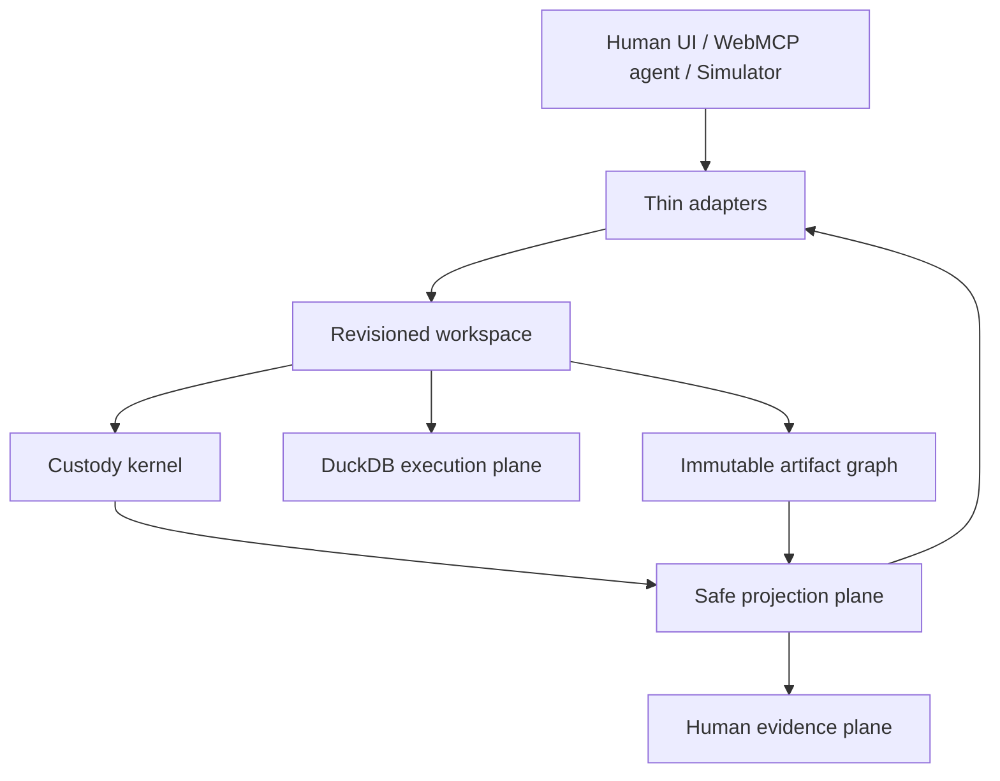
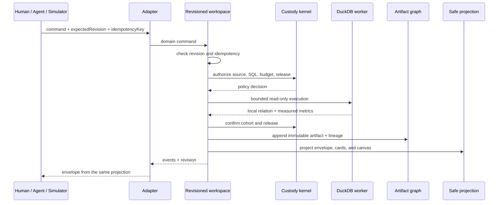
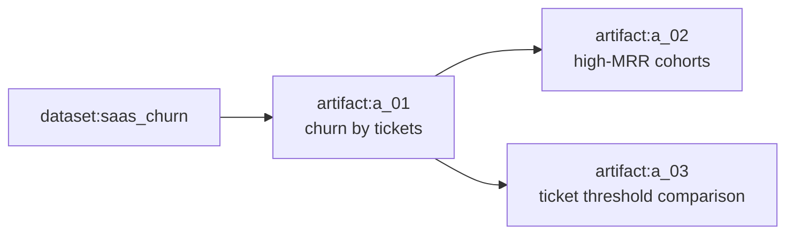

# DuckStudio Agent System Design

**Status:** canonical technical contract
**Protocol schema:** `duckstudio.webmcp/v1`

`PRODUCT.md` defines why DuckStudio exists. This document defines how agents, people, data, policy, execution, artifacts, and evidence compose into one deterministic system.

## 1. Design Goal

An agent should be able to enter an unfamiliar DuckStudio tab, understand the complete actionable state in one bounded read, perform useful analysis in one mutation, verify exactly what happened, recover from errors without guessing, and build subsequent work on stable artifacts rather than transcript memory.

The optimization target is:

- fewer tool calls;
- fewer repeated tokens;
- no hidden state;
- no raw sensitive release;
- bounded CPU, memory, and output;
- deterministic retry and concurrency behavior;
- reusable results with lineage;
- visible agreement between human and agent state.

## 2. Abstraction Tower



The revisioned workspace is the deep module. Its interface is the domain commands in §3. Custody, execution, artifacts, and projection sit behind that interface as implementation.

Adapters (human UI, prompt chips, Agent Simulator, WebMCP) validate transport input and dispatch those commands. They do not own revision, idempotency, policy, SQL, or presentation.

The human evidence plane renders the same projection the tools return. It is not a second state store.

## 3. Revisioned Workspace Interface

Every operator crosses one seam: the revisioned workspace. Four adapters justify that seam. Tests use the same interface.

### 3.1 Commands

Reads do not increment `revision`:

| Command | WebMCP tool |
|---|---|
| `getContext` | `duckdb_get_context` |
| `verifyCustody` | `duckdb_verify_zero_egress` |

Mutations require `expectedRevision` and `idempotencyKey` and increment `revision` once on commit:

| Command | WebMCP tool |
|---|---|
| `activateDataset` | `duckdb_activate_dataset` |
| `runAnalysis` | `duckdb_execute_sql_to_canvas` |
| `selectArtifact` | none — human and simulator only |
| `cancelActiveOperation` | none — human and simulator only |

WebMCP registers exactly the four tools. That is a subset of the workspace interface, not a second command set. Human controls and the simulator may dispatch all six commands. No adapter calls a private UI setter.

`selectArtifact` and `cancelActiveOperation` are workspace mutations. They are not operations in the left-pane stream except that cancel transitions the running operation to `cancelled`.

### 3.2 Command, event, and projection flow



Reads skip execution and artifact commit. `verifyCustody` reads custody evidence; it does not pulse chrome. If the evidence card renders a badge pulse, that is the human evidence plane painting the same projection.

Every accepted mutation appends events. Every projection is derived from those events and immutable artifacts. Tool envelopes, left-pane cards, and the four canvas views call one projection function. Adapters do not build a parallel representation.

### 3.3 Events

```ts
type WorkspaceEvent = {
  revision: number
  at: string
  kind:
    | "dataset_activated"
    | "analysis_succeeded"
    | "analysis_failed"
    | "artifact_selected"
    | "operation_cancelled"
  operationId?: string
  artifactId?: string
  datasetId?: string
  errorCode?: ErrorCode
}
```

Events are retained in a bounded ring buffer and may be requested with `sinceRevision`. A `sinceRevision` older than the buffer returns a compact current snapshot plus warning `DELTA_WINDOW_EXPIRED`.

## 4. Domain Model

### 4.1 Workspace

```ts
type Capability =
  | "activate_local_preset"
  | "run_readonly_sql"
  | "present_artifact"
  | "verify_custody"
  | "cancel_active_operation"
  | "select_artifact"
  | "webmcp_native"
  | "simulator_only"

type BudgetLimits = {
  executionMs: number
  resultRows: number
  chartPoints: number
  toolSummaryBytes: number
  retainedArtifacts: number
  contextItems: number
}

type Workspace = {
  workspaceId: string
  revision: number
  schemaVersion: "duckstudio.webmcp/v1"
  capabilities: Capability[]
  activeDatasetId: string | null
  selectedArtifactId: string | null
  budgets: BudgetLimits
  operations: OperationSummary[]
  recentArtifactIds: string[]
}
```

- `revision` starts at `0` and increments once per committed mutation.
- Reads never increment it.
- A command either commits all state and presentation changes or none.
- Canvas tab clicks (`insights` / `grid` / `sql_lineage` / `custody`) are not workspace state and do not increment revision.

### 4.2 Dataset and policy

```ts
type ColumnClassification =
  | "public"
  | "quasi_identifier"
  | "direct_identifier"
  | "sensitive"

type ColumnDigest = {
  name: string
  type: string
  classification: ColumnClassification
  omitted?: boolean
}

type Dataset = {
  datasetId: string
  displayName: string
  relationName: string
  rowCount: number
  byteSizeEstimate: number
  schemaDigest: ColumnDigest[]
  policy: "public_synthetic" | "sensitive_aggregate_only"
  minimumCohortSize: number
  loaded: boolean
}
```

`public_synthetic` permits safe grid rows and categorical values on the shared canvas after an artifact exists. `sensitive_aggregate_only` permits schema metadata and aggregates only after release checks; it never permits a raw grid in tool output or the shared canvas.

Activation does not paint a grid. Views bind to an artifact ID; there is no dataset-preview projection.

Demo policies are explicit and checked in; column-name matching is defense in depth, not the primary classifier. Cohort checks use `dataset.minimumCohortSize` (both one-day presets set `10`).

### 4.3 Analysis artifact

```ts
type LineageEntry =
  | { kind: "dataset"; id: string }
  | { kind: "artifact"; id: string }

type ReleaseDecision = {
  status: "allowed" | "downgraded"
  rawRowsToAgent: 0
  rawRowsToSharedCanvas: number
  omittedDirectIdentifiers: string[]
  cohortMinimum: number
  redactedBindingKeys: string[]
}

type ExecutionMetrics = {
  executionMs: number
  materializedRows: number
  chartPoints: number
}

type PresentationSpec = {
  kpis?: Array<{
    label: string
    column: string
    format: "percent" | "decimal" | "currency_usd" | "integer"
  }>
  chart?: {
    type: "bar" | "line" | "scatter"
    x: string
    y: string
    title?: string
    maxPoints?: number
  }
  grid?: { visible: boolean; maxRows?: number }
}

type AnalysisArtifact = {
  artifactId: string
  relationName: string
  source: { kind: "dataset" | "artifact"; id: string }
  sourceRevision: number
  sql: string
  sqlHash: string
  bindings: Record<string, string | number | boolean | null>
  schema: ColumnDigest[]
  rowCount: number
  lineage: LineageEntry[]
  policy: Dataset["policy"]
  release: ReleaseDecision
  presentation: PresentationSpec
  metrics: ExecutionMetrics
  createdAt: string
}
```

Artifacts are immutable. A refinement creates a new artifact whose lineage lists ancestors only, dataset then prior artifacts, and does not include the new artifact’s own id. `relationName` is generated by DuckStudio and is valid as a subsequent analysis source; agents do not invent it.

`sqlHash` is the lowercase hex SHA-256 of the exact submitted SQL string.

`bindings` on the artifact and in every projection are the redacted form. Raw binding values never leave the custody kernel: not in envelopes, cards, canvas, errors, logs, or telemetry.

`presentation` is the committed KPI, chart, and grid spec. It does not include an active view tab. Tab state lives only in the human evidence plane.



### 4.4 Operation

```ts
type OperationSummary = {
  operationId: string
  kind: "activate_dataset" | "run_analysis"
  status: "queued" | "running" | "succeeded" | "failed" | "cancelled"
  sourceId?: string
  artifactId?: string
  startedAt: string
  finishedAt?: string
  errorCode?: ErrorCode
}
```

Only one mutating operation (`activate_dataset` or `run_analysis`) runs at a time in the one-day build. `selectArtifact` is a mutation but not an operation: it appends `artifact_selected`, updates `selectedArtifactId`, and increments revision.

`cancelActiveOperation` aborts the running worker, sets that operation to `cancelled`, appends `operation_cancelled`, increments revision, creates no artifact, and leaves `selectedArtifactId` unchanged. Cancelling when no operation is running returns `VALIDATION_ERROR`.

### 4.5 Presentation inference

`runAnalysis` does not require `presentation`. The workspace infers a safe spec from the result schema and dataset policy. Inference is policy-aware by construction: it proposes only legal candidates — never a grid for `sensitive_aggregate_only`, never a KPI or chart axis on an omitted identifier — and an empty spec is legal. (Amended 2026-09-02, grilling 34: the kernel no longer downgrades presentations; see below.)

When `presentation` is omitted or a field is missing:

1. KPIs: up to six numeric result columns; `label` is the column name; `format` is `integer` for integral types and `decimal` otherwise.
2. Chart: if one categorical or integer column and one numeric column exist, infer `bar`; if two numeric columns exist, infer `scatter` on those axes.
3. Grid: `visible` is true only for `public_synthetic`.
4. After commit the canvas opens `insights` when any KPI or chart remains, otherwise `sql_lineage`. It never opens `grid` for `sensitive_aggregate_only`.

A supplied presentation is filled with the same rules for missing fields, then released. **Deny over strip (amended 2026-09-02, grilling 34):** an illegal supplied element denies the whole request with `POLICY_DENIED` carrying `blockedFields` and, when a legal spec exists, `permittedPresentation` — no element is ever silently removed or downgraded, and `PRESENTATION_DOWNGRADED` is therefore unreachable and removed from the §7 warning vocabulary. Inferred presentations never hit the denial path. Chart downsampling happens at commit and is disclosed as `CHART_DOWNSAMPLED`; the committed spec is unchanged.

Presentation refers only to columns produced by the analysis.

### 4.6 Budgets

| Budget | Default | Hard maximum |
|---|---:|---:|
| Execution duration | 5,000 ms | 15,000 ms |
| Materialized result rows | 10,000 | 50,000 |
| Chart points | 2,000 | 5,000 |
| Tool-response summary | 8 KB | 16 KB |
| Retained artifacts | 20 | 50 |
| Context items per read | 20 | 50 |

The agent may request a stricter `executionMs`, `resultRows`, or `chartPoints` but not exceed a hard maximum. A request above the hard maximum is `VALIDATION_ERROR`. Reaching an execution or materialization limit returns `BUDGET_EXCEEDED` and no partial artifact.

## 5. Custody Kernel

The custody kernel is one module. Dataset policy, SQL inspection, release, cohort confirmation, and upload/release evidence are its implementation. Callers of the workspace never invoke those pieces directly. There is no separate egress-audit module.

The workspace uses the kernel as:

1. Authorize the source and build the authorized relation set — the source relation only.
2. Inspect SQL against §6 before the worker runs.
3. Bound the requested budget.
4. After materialization, confirm cohort and column release. Denial here commits nothing.
5. Record upload and release evidence for `verifyCustody`.

Denied analysis produces `POLICY_DENIED` or `UNSAFE_SQL` and no artifact. Successful analysis stores a `ReleaseDecision` of `allowed` or `downgraded` on the artifact. The artifact’s `policy` is the policy at commit time and does not change if the workspace later activates another dataset.

### 5.1 Safe-release table

The kernel governs both WebMCP payloads and DOM projections visible to a browser agent.

| Output | `public_synthetic` | `sensitive_aggregate_only` |
|---|---|---|
| Schema names/types | Allowed | Allowed; direct identifiers marked omitted |
| Raw rows in tool payload | Never | Never |
| Raw rows in shared grid | Allowed within row budget, only on an artifact | Suppressed |
| Aggregates | Allowed | Allowed only when every cohort has `count >= minimumCohortSize` |
| Direct-identifier values | Never | Never |
| Sensitive categorical top values | Allowed for demo-safe columns | Suppressed |
| KPI/chart | Allowed | Aggregate-only after cohort check |
| SQL and bindings | Allowed | SQL allowed; binding values redacted in every projection |

The one-day implementation enforces explicit preset metadata, direct-identifier suppression, minimum aggregate cohort size, restricted aggregate output, and blocked raw grids. It does not claim differential privacy, protection against all differencing attacks, formal information-flow security, or regulatory certification. The persistent badge copy is `0 Bytes of Dataset Uploaded`; application-shell traffic is outside that accounting.

## 6. SQL Execution Policy

Allowed:

- exactly one statement beginning with `SELECT` or `WITH` after comments/whitespace;
- DuckDB analytical expressions and joins that reference only the authorized source relation;
- named parameter bindings supplied separately from SQL;
- aggregate, filter, grouping, ordering, and bounded window operations.

Rejected before execution:

- multiple statements or semicolon-separated payloads;
- DDL, DML, and transaction control;
- `ATTACH`, `DETACH`, `COPY`, `EXPORT`, `IMPORT`, `INSTALL`, `LOAD`, `CALL`, `PRAGMA` mutations;
- URL literals and external table functions such as HTTP, S3, filesystem glob, CSV/Parquet scans over paths;
- extension loading or network-capable functions;
- references outside the authorized source relation set;
- string interpolation of values where bindings are supported.

SQL literals in the statement are not a substitute for bindings; they remain in stored SQL and are visible in lineage. Sensitive values belong in bindings so the kernel can redact them.

The worker is initialized without network/filesystem extensions. Validation is runtime enforcement, not merely browser-visible JSON Schema.

## 7. Uniform Envelope

The envelope module is the trust seam for every command result. JSON Schema in this document is the human copy of that interface; implementation stores one schema module that adapters and tests import. Do not hand-duplicate schemas in adapter files.

```ts
type ToolName =
  | "duckdb_get_context"
  | "duckdb_activate_dataset"
  | "duckdb_execute_sql_to_canvas"
  | "duckdb_verify_zero_egress"

type NextAction =
  | { kind: "tool"; tool: ToolName; input: Record<string, unknown> }
  | { kind: "human_action"; action: "select_local_file" }

type WarningCode =
  | "DELTA_WINDOW_EXPIRED"
  | "CHART_DOWNSAMPLED"
  | "BUDGET_CLAMPED"

type Warning = {
  code: WarningCode
  message: string
  details?: Record<string, string | number | boolean | null>
}

type Envelope<D> =
  | {
      ok: true
      schemaVersion: "duckstudio.webmcp/v1"
      workspaceId: string
      revision: number
      data: D
      contextDelta?: Record<string, unknown>
      warnings: Warning[]
      nextActions: NextAction[]
    }
  | {
      ok: false
      schemaVersion: "duckstudio.webmcp/v1"
      workspaceId: string
      revision: number
      error: {
        code: ErrorCode
        message: string
        retryable: boolean
        details: Record<string, string | number | boolean | null>
      }
      nextActions: NextAction[]
    }
```

`data` is specific to the command. `contextDelta` is the same workspace projection restricted to fields that changed; it is not a second model.

`nextActions` are legal, executable suggestions, not natural-language advice. They are bounded to three entries.

Success:

```json
{
  "ok": true,
  "schemaVersion": "duckstudio.webmcp/v1",
  "workspaceId": "ws_local_01",
  "revision": 4,
  "data": {},
  "contextDelta": { "selectedArtifactId": "a_01" },
  "warnings": [],
  "nextActions": []
}
```

Failure:

```json
{
  "ok": false,
  "schemaVersion": "duckstudio.webmcp/v1",
  "workspaceId": "ws_local_01",
  "revision": 4,
  "error": {
    "code": "STALE_REVISION",
    "message": "Expected revision 3; current revision is 4.",
    "retryable": true,
    "details": { "expectedRevision": 3, "currentRevision": 4 }
  },
  "nextActions": [
    {
      "kind": "tool",
      "tool": "duckdb_get_context",
      "input": { "scope": "events", "sinceRevision": 3 }
    }
  ]
}
```

## 8. Tool Contracts

JSON snippets below are canonical input schemas. All schemas set `additionalProperties: false`. Implementation encodes them once.

### 8.1 `duckdb_get_context`

**Description:** Read the smallest sufficient workspace context or revision delta before acting. Has no side effects and never returns raw rows.

```json
{
  "type": "object",
  "properties": {
    "scope": { "type": "string", "enum": ["summary", "schema", "artifact", "events"] },
    "datasetId": { "type": "string", "maxLength": 80 },
    "artifactId": { "type": "string", "maxLength": 80 },
    "sinceRevision": { "type": "integer", "minimum": 0 },
    "limit": { "type": "integer", "minimum": 1, "maximum": 50, "default": 20 }
  },
  "required": ["scope"],
  "additionalProperties": false,
  "allOf": [
    {
      "if": { "properties": { "scope": { "const": "schema" } }, "required": ["scope"] },
      "then": { "required": ["datasetId"] }
    },
    {
      "if": { "properties": { "scope": { "const": "artifact" } }, "required": ["scope"] },
      "then": { "required": ["artifactId"] }
    }
  ]
}
```

Rules:

- `events` normally includes `sinceRevision`.
- `summary` returns capabilities, current revision, active dataset/policy, budgets, active operation, recent artifacts, and next actions.
- Register with `annotations: { "readOnlyHint": true }`.

Compact bootstrap response data:

```json
{
  "capabilities": ["activate_local_preset", "run_readonly_sql", "present_artifact", "verify_custody", "cancel_active_operation", "select_artifact"],
  "activeDataset": { "datasetId": "saas_churn", "policy": "public_synthetic", "rowCount": 250000 },
  "budgets": { "executionMs": 5000, "resultRows": 10000, "chartPoints": 2000 },
  "selectedArtifactId": null,
  "recentArtifacts": []
}
```

### 8.2 `duckdb_activate_dataset`

**Description:** Activate one dataset already local to this tab. Changes workspace state atomically; use the current revision and an idempotency key.

```json
{
  "type": "object",
  "properties": {
    "datasetId": { "type": "string", "enum": ["saas_churn", "healthcare_pii"] },
    "expectedRevision": { "type": "integer", "minimum": 0 },
    "idempotencyKey": { "type": "string", "minLength": 8, "maxLength": 80 }
  },
  "required": ["datasetId", "expectedRevision", "idempotencyKey"],
  "additionalProperties": false
}
```

Response data includes `datasetId`, safe `schemaDigest`, `rowCount`, `byteSizeEstimate`, `policy`, and `minimumCohortSize`. Replaying the same key with the same input returns the original envelope. Reusing it with different input returns `IDEMPOTENCY_CONFLICT`. Activation does not select an artifact and does not render rows.

### 8.3 `duckdb_execute_sql_to_canvas`

**Description:** Run one bounded read-only analysis against a dataset or prior artifact, create an immutable result artifact, infer or apply a safe presentation, and select that artifact atomically. Returns only a safe summary and handles, never result rows.

```json
{
  "type": "object",
  "properties": {
    "source": {
      "type": "object",
      "properties": {
        "kind": { "type": "string", "enum": ["dataset", "artifact"] },
        "id": { "type": "string", "maxLength": 80 }
      },
      "required": ["kind", "id"],
      "additionalProperties": false
    },
    "sql": { "type": "string", "minLength": 1, "maxLength": 12000 },
    "bindings": {
      "type": "object",
      "additionalProperties": { "type": ["string", "number", "boolean", "null"] },
      "maxProperties": 40
    },
    "presentation": {
      "type": "object",
      "properties": {
        "kpis": {
          "type": "array",
          "maxItems": 6,
          "items": {
            "type": "object",
            "properties": {
              "label": { "type": "string", "minLength": 1, "maxLength": 60 },
              "column": { "type": "string", "minLength": 1, "maxLength": 80 },
              "format": { "type": "string", "enum": ["percent", "decimal", "currency_usd", "integer"] }
            },
            "required": ["label", "column", "format"],
            "additionalProperties": false
          }
        },
        "chart": {
          "type": "object",
          "properties": {
            "type": { "type": "string", "enum": ["bar", "line", "scatter"] },
            "x": { "type": "string", "minLength": 1, "maxLength": 80 },
            "y": { "type": "string", "minLength": 1, "maxLength": 80 },
            "title": { "type": "string", "maxLength": 120 },
            "maxPoints": { "type": "integer", "minimum": 10, "maximum": 5000 }
          },
          "required": ["type", "x", "y"],
          "additionalProperties": false
        },
        "grid": {
          "type": "object",
          "properties": {
            "visible": { "type": "boolean" },
            "maxRows": { "type": "integer", "minimum": 1, "maximum": 50000 }
          },
          "required": ["visible"],
          "additionalProperties": false
        },
        "initialView": { "type": "string", "enum": ["insights", "grid", "sql_lineage", "custody"] }
      },
      "additionalProperties": false
    },
    "budget": {
      "type": "object",
      "properties": {
        "executionMs": { "type": "integer", "minimum": 100, "maximum": 15000 },
        "resultRows": { "type": "integer", "minimum": 1, "maximum": 50000 },
        "chartPoints": { "type": "integer", "minimum": 10, "maximum": 5000 }
      },
      "additionalProperties": false
    },
    "expectedRevision": { "type": "integer", "minimum": 0 },
    "idempotencyKey": { "type": "string", "minLength": 8, "maxLength": 80 }
  },
  "required": ["source", "sql", "bindings", "expectedRevision", "idempotencyKey"],
  "additionalProperties": false
}
```

Runtime validation enforces this same contract; browser-visible schema is discoverability, not the trust boundary.

`initialView` is a request to the human evidence plane for which tab to open after commit. It is not stored on the artifact. If omitted, inference in §4.5 chooses the tab. `grid` as `initialView` is ignored when policy forbids a grid.

Response data:

```json
{
  "operationId": "op_01",
  "artifact": {
    "artifactId": "a_01",
    "relationName": "artifact_a_01",
    "source": { "kind": "dataset", "id": "saas_churn" },
    "rowCount": 9,
    "schema": [
      { "name": "tickets", "type": "INTEGER", "classification": "public" },
      { "name": "churn_rate", "type": "DOUBLE", "classification": "public" }
    ],
    "lineage": [{ "kind": "dataset", "id": "saas_churn" }],
    "release": {
      "status": "allowed",
      "rawRowsToAgent": 0,
      "rawRowsToSharedCanvas": 9,
      "omittedDirectIdentifiers": [],
      "cohortMinimum": 10,
      "redactedBindingKeys": []
    }
  },
  "summary": {
    "kpis": [
      { "label": "Churn Rate", "column": "churn_rate", "format": "percent", "value": 0.142 },
      { "label": "Avg Tickets", "column": "tickets", "format": "decimal", "value": 4.8 },
      { "label": "Impacted MRR", "column": "mrr", "format": "currency_usd", "value": 182400 }
    ],
    "chart": { "type": "scatter", "x": "tickets", "y": "churn_rate", "pointCount": 9 }
  },
  "metrics": {
    "executionMs": 23.4,
    "materializedRows": 9,
    "chartPoints": 9
  }
}
```

`summary.kpis` is the projected `PresentationSpec.kpis` plus measured values. It is not a dataset-specific struct. Only measured metrics are returned. The UI formats but does not replace them with target values.

Left-pane artifact cards and Insights render this same `summary`.

### 8.4 `duckdb_verify_zero_egress`

**Description:** Read a scoped, timestamped evidence snapshot for dataset uploads, sensitive releases, monitored transports, and operation lineage. Operational evidence only; not a formal proof.

```json
{
  "type": "object",
  "properties": {
    "scope": { "type": "string", "enum": ["workspace", "operation", "artifact"] },
    "operationId": { "type": "string", "maxLength": 80 },
    "artifactId": { "type": "string", "maxLength": 80 },
    "sinceRevision": { "type": "integer", "minimum": 0 }
  },
  "required": ["scope"],
  "additionalProperties": false,
  "allOf": [
    {
      "if": { "properties": { "scope": { "const": "operation" } }, "required": ["scope"] },
      "then": { "required": ["operationId"] }
    },
    {
      "if": { "properties": { "scope": { "const": "artifact" } }, "required": ["scope"] },
      "then": { "required": ["artifactId"] }
    }
  ]
}
```

Register with `annotations: { "readOnlyHint": true }`. Artifact-scoped evidence uses that artifact’s stored policy. Response data:

```json
{
  "observedAt": "2026-08-31T12:00:00.000Z",
  "scope": { "kind": "artifact", "id": "a_01" },
  "datasetBytesUploaded": 0,
  "rawSensitiveValuesReleasedToTools": 0,
  "rawSensitiveValuesReleasedToSharedCanvas": 0,
  "monitoredTransports": ["fetch", "XMLHttpRequest", "sendBeacon", "WebSocket", "WebTransport"],
  "policy": "public_synthetic",
  "lineage": [{ "kind": "dataset", "id": "saas_churn" }, { "kind": "artifact", "id": "a_01" }],
  "limitations": ["Application shell traffic is outside dataset-upload accounting.", "Runtime interception is operational evidence, not a formal proof."]
}
```

Verify-custody lineage for an artifact includes the artifact’s own id after its ancestors so the evidence snapshot names the subject.

### 8.5 Human-only mutations

These commands are part of the workspace interface and are not registered as WebMCP tools.

`selectArtifact`:

```json
{
  "type": "object",
  "properties": {
    "artifactId": { "type": "string", "maxLength": 80 },
    "expectedRevision": { "type": "integer", "minimum": 0 },
    "idempotencyKey": { "type": "string", "minLength": 8, "maxLength": 80 }
  },
  "required": ["artifactId", "expectedRevision", "idempotencyKey"],
  "additionalProperties": false
}
```

`cancelActiveOperation`:

```json
{
  "type": "object",
  "properties": {
    "operationId": { "type": "string", "maxLength": 80 },
    "expectedRevision": { "type": "integer", "minimum": 0 },
    "idempotencyKey": { "type": "string", "minLength": 8, "maxLength": 80 }
  },
  "required": ["expectedRevision", "idempotencyKey"],
  "additionalProperties": false
}
```

If `operationId` is omitted, cancel targets the single running operation. A missing, stale, or non-running id is `VALIDATION_ERROR`.

### 8.6 WebMCP best-practice conformance

The four tools are audited against the 2026 `modern-web-guidance` WebMCP best practices (collected in `docs/webmcp-best-practices.md`). Conformance is recorded here so the canonical contract stays the source of truth.

**Aligned:**

- **One tool = one function.** Four tools, no overlap: `duckdb_get_context` reads workspace state, `duckdb_activate_dataset` and `duckdb_execute_sql_to_canvas` execute mutations, `duckdb_verify_zero_egress` reads evidence. Reads and mutations never collide on intent.
- **Execution vs. initiation.** All four names use execution verbs (`get`, `activate`, `execute`, `verify`). There is no "start-process" tool; the human-only mutations (`selectArtifact`, `cancelActiveOperation`) are workspace commands, not WebMCP tools.
- **Positive language, negative only for hard invariants.** Descriptions state what each tool does. "never returns raw rows" and "not a formal proof" are the two negative phrases kept, because they are non-negotiable safety invariants, not usage discouragement.
- **Strict-in-code, loose-in-schema.** §8 already declares "browser-visible schema is discoverability, not the trust boundary." Runtime `.parse()` is the seam; field-level `details` give the model enough to self-correct (§9).
- **Specific types, natural-language choices.** `enum` is used for every choice the agent must pick from (`scope`, dataset IDs, formats, chart types, view tabs). No ambiguous numeric IDs.
- **Raw user input.** `run_analysis` accepts `sql` and `bindings` as submitted; the agent is not asked to transform or compute.
- **Graceful failure and recovery.** Every error code in §9 maps to an executable recovery action, matching the four failure modes (wrong state, invalid parameter, unexpected return, business-rule violation).
- **Registration lifecycle.** §10 already manages registration with an `AbortController`; duplicate registration is a defect.

**Deviations (deliberate):**

- **Tool-output budget.** The practice recommends a 1.5 K-character cap per tool output to avoid guardrails. DuckStudio's `toolSummaryBytes` default is 8 KB (16 KB hard max). This is deliberate: the envelope carries structured, machine-readable data (KPIs, schema digests, lineage, evidence) rather than prose, and the "one-read legibility" acceptance scenario requires a complete actionable summary in one bounded read. The budget is bytes, enforced at runtime, and measured — never exceeded silently.
- **Origin trust.** The practice says expose tools only to trusted origins. DuckStudio is a single-origin, self-hosted static app with no third-party dependencies on the tool path (ADR 0006). WebMCP registration is gated on `document.modelContext` in a secure context, so the read/write tools are only reachable from the app's own origin by construction. No cross-origin allow-list is needed.

**Adopted (new):**

- **Parameter descriptions.** Each JSON Schema parameter in §8.1–§8.4 must carry a `description` field (≤150 characters, parameter name ≤30 characters, tool description ≤500 characters) in the implemented schema module. The schemas in this document are the human copy; implementation adds the `description` fields via `z.describe()` so the WebMCP-discoverable surface carries the same prose. A contract test in `agent-control-plane/_contract/` asserts no tool description exceeds 500 characters and no parameter name exceeds 30 characters.

## 9. Error Taxonomy and Recovery

```ts
type ErrorCode =
  | "VALIDATION_ERROR"
  | "STALE_REVISION"
  | "IDEMPOTENCY_CONFLICT"
  | "POLICY_DENIED"
  | "UNSAFE_SQL"
  | "BUDGET_EXCEEDED"
  | "DATASET_UNAVAILABLE"
  | "ARTIFACT_UNAVAILABLE"
  | "OPERATION_CONFLICT"
  | "OPERATION_CANCELLED"
  | "UNSUPPORTED_CAPABILITY"
  | "INTERNAL_ERROR"
```

| Code | Meaning | Retryable | Required recovery |
|---|---|---:|---|
| `VALIDATION_ERROR` | Input/schema mismatch | No | Use field details and corrected input. |
| `STALE_REVISION` | Workspace changed | Yes | Read delta from expected revision, then retry with current revision and a new key. |
| `IDEMPOTENCY_CONFLICT` | Key reused for different command | No | Generate a new key or resend the original command exactly. |
| `POLICY_DENIED` | SQL or presentation would cross release policy | No | Use `details.permittedPresentation` when present, or safer SQL. |
| `UNSAFE_SQL` | Statement violates execution policy | No | Apply the returned blocked construct details. |
| `BUDGET_EXCEEDED` | Runtime or materialization exceeded budget | Yes | Narrow the query or request an allowed larger budget. |
| `DATASET_UNAVAILABLE` | Dataset is not loaded/local | Yes | Activate an available preset or ask the person to select a file. |
| `ARTIFACT_UNAVAILABLE` | Artifact does not exist or was evicted | Yes | Read recent artifacts; recompute only if necessary. |
| `OPERATION_CONFLICT` | Another `activate_dataset` or `run_analysis` is running | Yes | Read events or wait for/cancel the active operation. |
| `OPERATION_CANCELLED` | Human cancelled execution | Yes | Reconfirm intent before retrying. |
| `UNSUPPORTED_CAPABILITY` | Required browser capability is absent | No | Use the simulator or follow the returned human action. |
| `INTERNAL_ERROR` | Unclassified local failure | Yes | Read current context; do not expose sensitive stack data. |

`POLICY_DENIED` `details` include `blockedFields` and, when a legal aggregate-only presentation exists, `permittedPresentation` as a `PresentationSpec`.

`selectArtifact` while an operation is running is allowed: it is not an operation and does not take the single-flight slot. `activateDataset` / `runAnalysis` / `cancelActiveOperation` while another operation is running return `OPERATION_CONFLICT` except that cancel targets that running operation.

Errors never echo raw rows, sensitive bindings, or full internal stack traces.

Runtime engine failures (DuckDB diagnostics, budget exhaustion, worker respawn) are classified at the custody seam before they become envelopes: policy violations map to their table code above, exhausted budgets to `BUDGET_EXCEEDED`, and anything unclassified to `INTERNAL_ERROR` with `retryable: true`. `error.details` carries only recovery-useful hints — blocked construct, offending clause kind, budget axis, elapsed and limit values — so the agent's recovery loop is: read `code` + `details`, apply the recovery column, re-dispatch. There is no fix-up tool; §12's playbooks are the loop.

## 10. State, Retry, and Lifecycle Semantics

- Adapters validate inputs against the shared schema module, then dispatch domain commands.
- Tool registration is lifecycle-managed with an `AbortController`; duplicate registration is an implementation defect, not a normal state.
- An idempotency cache stores the final envelope for the last 100 mutation keys within the tab session, including `selectArtifact` and `cancelActiveOperation`.
- Revision checking occurs before execution. Revision increments only after a successful commit of artifact (when any), events, and selected artifact.
- A successful replay returns the original revision and artifact ID, not a duplicate artifact.
- Stale recovery uses a **new** idempotency key with the current revision. Exact replay uses the **same** key and the original input, including the original `expectedRevision`.
- Artifact eviction removes only the local materialized relation after the retention limit; its metadata remains in the event log while retained. The UI discloses eviction.
- Cancel commits an event and a revision increment with no artifact.

## 11. Capability Negotiation

`duckdb_get_context(scope: "summary")` exposes enums rather than prose:

- `activate_local_preset`
- `run_readonly_sql`
- `present_artifact`
- `verify_custody`
- `cancel_active_operation`
- `select_artifact`
- `webmcp_native` or `simulator_only`

Unavailable human gestures appear in `nextActions` as `{ kind: "human_action", action: "select_local_file" }`. Tools never fabricate file paths or pretend to complete the gesture.

## 12. Agent Playbooks

### Bootstrap and analyze

1. Call `duckdb_get_context({ scope: "summary" })`.
2. If the desired local dataset is active, call `duckdb_execute_sql_to_canvas` with its ID, returned revision, unique key, bounded SQL, and bindings. Omit `presentation` unless a specific view is required.
3. Use the returned artifact ID for explanation or refinement. Do not request rows.

### Activate then analyze

1. Read summary.
2. Call `duckdb_activate_dataset` with returned revision.
3. Call `duckdb_execute_sql_to_canvas` with the new revision and returned dataset ID.

### Refine without recomputation

1. Use `source: { kind: "artifact", id: "a_01" }`.
2. Query the generated artifact relation described by context.
3. Receive a new artifact whose lineage includes `a_01` as an ancestor.

### Recover from stale state

1. Follow the error’s `duckdb_get_context` delta action.
2. Re-evaluate whether the intended source is still active/available.
3. Retry with current revision and a new idempotency key.

### Recover from policy denial

1. Read `details.blockedFields` and `details.permittedPresentation`.
2. Resubmit with that presentation or with safer SQL.
3. Ensure every sensitive cohort has at least `minimumCohortSize` members.

### Recover from budget denial

1. Aggregate earlier, reduce dimensions, filter the source, or lower chart cardinality.
2. Increase a requested budget only when the current context says the larger value is allowed.

### Verify custody

Call `duckdb_verify_zero_egress` for the relevant artifact or operation. Report its scope and limitations with the evidence; do not broaden the claim.

## 13. UI Projection Contract

The left pane shows:

- active dataset and policy;
- workspace revision;
- tool/operation cards with stable IDs and measured status;
- artifact cards with handle, source, and the same safe `summary` as the envelope;
- structured recovery cards for errors.

The right pane selects exactly one artifact and shows:

- **Insights:** approved KPIs and chart from the projection;
- **Data Grid:** virtualized rows only when an artifact exists and policy permits, otherwise a policy suppression panel or an empty-selection state;
- **SQL & Lineage:** exact SQL, redacted bindings, SQL hash, source, artifact chain, and measured runtime;
- **Custody:** scoped evidence and limitations from the same snapshot `verifyCustody` returns.

Changing a view tab does not dispatch a workspace command. Selecting an artifact dispatches `selectArtifact` through the same command path regardless of operator.

## 14. Simulator Parity

Prompt chips and the built-in Agent Simulator are scripted clients of the revisioned workspace. They do not call private UI setters or manufacture transcript results. In a native WebMCP environment the same tool adapters invoke that workspace. Contract tests run identical scenarios through both adapters and compare events, artifacts, revisions, errors, and projections.

## 15. Acceptance Scenarios

1. **One-read legibility:** empty or active workspace is actionable from one `summary` response under 8 KB.
2. **Low-call analysis:** with `saas_churn` active, context plus analysis takes two calls and creates one artifact plus one atomic presentation, with presentation inferred when omitted.
3. **Accretive refinement:** a second analysis uses the first artifact ID and lineage without recomputing its source query.
4. **No raw tool rows:** every tool response has zero result-row arrays.
5. **Sensitive DOM safety:** `healthcare_pii` never paints raw rows; grid view explains policy suppression.
6. **Cohort guard:** a sensitive aggregate with any group below `minimumCohortSize` returns `POLICY_DENIED` and no artifact.
7. **SQL isolation:** URL scans, external files, extensions, exports, mutations, and multiple statements are rejected before worker execution.
8. **Stale-state safety:** a mutation with an old revision returns current revision and an executable delta-read recovery action.
9. **Retry safety:** replaying the same mutation key returns the same artifact and revision; conflicting reuse fails.
10. **Bounded execution:** runtime/materialization over budget produces no partial artifact or partial canvas.
11. **Cancellation:** `cancelActiveOperation` increments revision, leaves the previous artifact selected, and reports `OPERATION_CANCELLED`.
12. **Honest custody:** audit distinguishes dataset upload bytes from shell traffic and always returns limitations.
13. **Operator parity:** human, simulator, and WebMCP paths produce identical domain events for equivalent commands.
14. **Lifecycle safety:** unmount/remount leaves exactly one registration for each tool.
15. **One projection:** envelope `summary`, left artifact card, and Insights KPIs are the same object for a given artifact.
16. **Named mutations:** artifact card selection dispatches `selectArtifact`; Cancel dispatches `cancelActiveOperation`; neither path sets React state privately.
17. **No preview grid:** activating a dataset without an artifact paints no rows.
