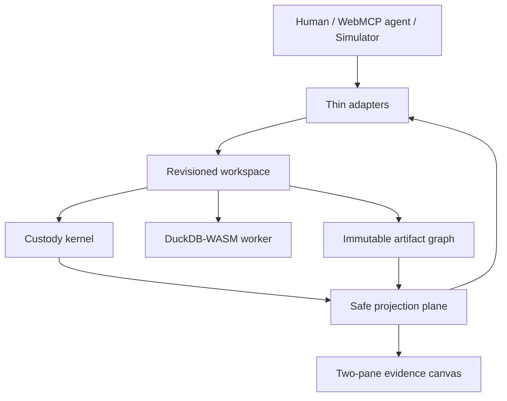
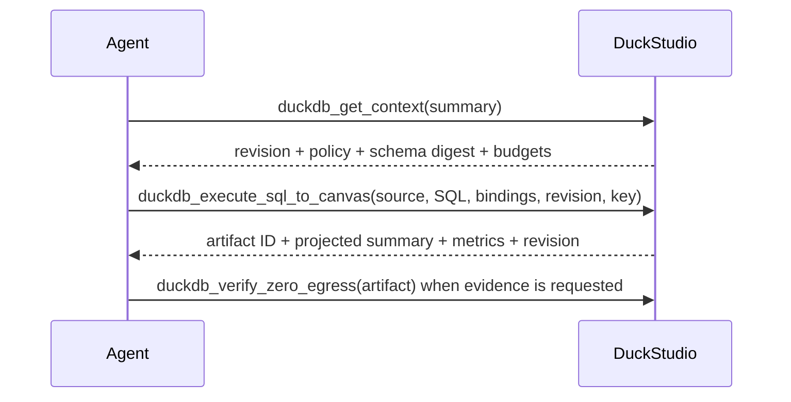

# PRD: DuckStudio

**A zero-upload, agent-native data lab powered by DuckDB-WASM and WebMCP**

## 1. Product Thesis

Sensitive data cannot be sent to a cloud model, and a cloud model cannot directly query browser RAM. DuckStudio lets an agent actuate a governed DuckDB-WASM workspace inside the tab while a custody kernel controls what crosses into tool responses and the agent-visible canvas.

The differentiator is not merely local SQL. It is a coherent control system:

- one bounded context read makes state and capabilities legible;
- one atomic analysis command executes, records lineage, creates a reusable artifact, and presents it;
- every mutation is revisioned and idempotent;
- every result compounds into an immutable artifact graph;
- one safe-release boundary governs both tools and DOM;
- custody evidence is scoped, visible, and honest.



## 2. Winning Strategy

| Criterion | DuckStudio proof |
|---|---|
| **WebMCP Leverage** | A page-local agent control plane operates data that cannot safely be uploaded and state that cannot exist on a remote API. |
| **Execution** | Context, query, artifact, SQL, lineage, chart, policy, and audit remain coherent on one screen and one state model. |
| **Potential Impact** | Analysts under egress bans can delegate bounded analysis without transferring custody or exposing sensitive rows. |
| **Creativity & Ambition** | DuckStudio treats WebMCP as a revisioned local operating surface with safe release and reusable artifact lineage, not a collection of UI shortcuts. |

## 3. One-Day Scope

| Layer | Must ship | Explicitly cut |
|---|---|---|
| **Custody kernel** | Explicit preset policies, SQL guard, release guard, upload telemetry | Differential privacy, formal proofs, compliance certification |
| **Workspace** | ID, revision, six domain commands, selected artifact, one active operation, bounded events | Persistence across tabs, collaboration, multi-agent locking |
| **Execution** | One DuckDB-WASM Web Worker; bounded read-only SQL with bindings | Writes, exports, external connectors, multi-file join wizards, arbitrary files on tape |
| **Artifacts** | Immutable metadata + local relation + lineage; bounded retention | Durable notebooks, branching UI, artifact sharing |
| **Control plane** | Four WebMCP tools as a subset of the workspace interface; one envelope; stable errors; revisions; idempotency; delta context | Compatibility aliases, conversational orchestration server, `egress-audit/` folder |
| **Safe projections** | One summary object for envelope, cards, and Insights; sensitive raw-grid suppression; `minimumCohortSize` | General privacy theorem, unrestricted ad hoc PII analysis |
| **Evidence UI** | One screen, two panes, four artifact views, operation cards, policy and revision | Routing, auth, dashboards, 3D visualization, voice |
| **Demo** | Two seeded presets and one locked agent-native path | More datasets, extra prompt chips, paid model setup |

## 4. Agent Control Plane

The canonical schemas and semantics are in `docs/agent-system-design.md`.

| Tool | Side effect | Purpose |
|---|---:|---|
| `duckdb_get_context` | None | Bootstrap or delta-read capabilities, revision, active policy, compact schema, budgets, operations, artifacts, and legal next actions. |
| `duckdb_activate_dataset` | Workspace mutation | Activate `saas_churn` or `healthcare_pii` with `expectedRevision` and `idempotencyKey`. |
| `duckdb_execute_sql_to_canvas` | Workspace mutation | Validate and run one bounded query, create one artifact, infer or apply KPI/chart/grid presentation, and select that artifact atomically. |
| `duckdb_verify_zero_egress` | None | Return scoped dataset-upload, safe-release, interceptor, policy, and lineage evidence with limitations. |

Human and simulator adapters also dispatch `selectArtifact` and `cancelActiveOperation`. Those commands are not WebMCP tools.

### 4.1 Shared response envelope

All tools return `schemaVersion`, `workspaceId`, and current `revision`.

- Success adds `data`, optional `contextDelta`, `warnings`, and at most three executable `nextActions` of kind `tool` or `human_action`.
- Failure adds stable `error.code`, `message`, `retryable`, field details, and recovery actions.
- No response contains result rows.
- Tool descriptions declare preconditions, side effects, release behavior, and next-step guidance.

### 4.2 Normal agent path



Activation is omitted when the desired dataset is already active. Refinements source a prior artifact ID so earlier work is not repeated.

### 4.3 Registration and parity

Tools register with `document.modelContext.registerTool(...)` and full JSON Schema. Read tools carry `readOnlyHint`. Runtime validation remains mandatory. Registration uses an `AbortController` for lifecycle cleanup.

The human controls, prompt chips, Agent Simulator, and WebMCP adapters all dispatch the same domain commands through the revisioned workspace. No adapter calls private React setters or fabricates a result. Envelope `summary`, artifact cards, and Insights are one projection.

## 5. Custody and Correctness Contract

### 5.1 Shared safe-release boundary

A browser agent can inspect tool output and the page. Therefore sensitive values must be governed before either destination:

- tool payloads never include result rows;
- `public_synthetic` artifacts may render bounded rows in Data Grid; activation without an artifact paints no rows;
- `sensitive_aggregate_only` artifacts never render raw rows;
- direct identifiers never appear as values;
- sensitive aggregate groups require at least `minimumCohortSize` source rows (presets: 10);
- unsafe presentation requests are denied (`POLICY_DENIED` with `blockedFields` and `permittedPresentation` when one exists) — unsafe elements are never silently removed or downgraded;
- sensitive bindings are redacted in projected SQL lineage.

### 5.2 SQL policy

Accept exactly one read-only `SELECT` or `WITH` statement with separate parameter bindings. Reject mutations, DDL, transactions, multiple statements, external URLs/files, `ATTACH`, `COPY`, `INSTALL`, `LOAD`, export, extension loading, and unauthorized relations before worker execution. The full deny list is `docs/agent-system-design.md` §6.

### 5.3 Resource policy

Defaults: 5,000 ms execution, 10,000 materialized rows, 2,000 chart points, 8 KB tool summary, 20 retained artifacts, 20 context items. Hard maxima: 15,000 ms, 50,000 rows, 5,000 points, 16 KB, 50 artifacts, 50 context items.

No partial artifact or partial canvas commits after cancellation, policy denial, or budget failure. Metrics shown to agents and people are measured values; targets are never substituted.

### 5.4 State policy

- Mutations require the current `expectedRevision`.
- Mutation retries require `idempotencyKey` and return the original result when replayed exactly.
- Artifacts are immutable and carry source, SQL, SQL hash, bindings, schema, lineage, release decision, presentation, and measured metrics.
- There is no global “last result” or “last SQL.” The selected artifact determines every view.

## 6. Preset Contract

### 6.1 `saas_churn`

- 250,000 seeded rows, approximately 14.2 MB, policy `public_synthetic`.
- Fourteen columns including `tickets`, `churned`, `churn_rate`, and `mrr`.
- The canonical query groups by ticket count and computes the three headline values from the seed:
  - Churn Rate `14.2%`;
  - Avg Tickets `4.8 / mo`;
  - Impacted MRR `$182,400`.
- Scatter output visibly increases when `tickets > 5`.
- The run creates one artifact, infers or applies KPI and scatter specifications, and selects that artifact. Insights opens because a chart and KPIs remain.

### 6.2 `healthcare_pii`

- 100,000 seeded rows, policy `sensitive_aggregate_only`, minimum cohort size ten.
- Includes `diagnosis`, direct identifier `mrn`, and enough safe grouping columns for an aggregate demonstration.
- Context marks `mrn` as an omitted direct identifier rather than returning values.
- Data Grid shows a policy suppression panel, not rows.
- Aggregate analysis is allowed only when every output cohort has at least ten records.

## 7. Two-Pane Evidence UI

```text
+------------------------------------------------------------------------------------------------------+
| DuckStudio | dataset: saas_churn | policy: public_synthetic | rev 4 | 0 Bytes of Dataset Uploaded   |
+------------------------------------------+-----------------------------------------------------------+
| AGENT CONTROL & OPERATIONS (35%)         | SELECTED ARTIFACT (65%)                                  |
|                                          |                                                           |
| Context · ws_local_01 · rev 3            | [Insights] [Data Grid] [SQL & Lineage] [Custody]          |
| saas_churn · 250k · 14 cols              |                                                           |
| budget 5s / 10k rows / 2k points         | a_01 · source saas_churn · succeeded                     |
|                                          | KPI cards + chart                                         |
| duckdb_execute_sql_to_canvas · op_01     |                                                           |
| succeeded · measured runtime             | SQL hash · exact statement · lineage                     |
|                                          |                                                           |
| Artifact a_01                            | Policy release: allowed                                   |
| safe summary · no rows returned          |                                                           |
+------------------------------------------+-----------------------------------------------------------+
```

### 7.1 Left pane

- Active-table chip updates immediately after activation.
- Context card displays workspace ID, revision, policy, safe schema count, and active budgets.
- Amber operation pills use exact registered tool names.
- Operation cards expose status and operation ID; the active one has Cancel, which dispatches `cancelActiveOperation`.
- Artifact cards expose stable handle, source, the same safe `summary` as the envelope, and a selection action that dispatches `selectArtifact`.
- Errors render code, concise message, and recovery action rather than stack traces.

### 7.2 Right pane

- **Insights:** policy-approved KPIs and ECharts view.
- **Data Grid:** virtualized public synthetic rows, or a sensitive-policy suppression panel.
- **SQL & Lineage:** exact SQL, safe bindings, hash, source, artifact chain, release decision, and measured metrics.
- **Custody:** scoped evidence with explicit limitations.

Canvas tabs are not workspace state. Switching tabs never dispatches a command and never changes artifact contents. Selecting an artifact dispatches `selectArtifact`.

### 7.3 First paint

The first paint is an empty workspace with no dataset rows. The badge reads `0 Bytes of Dataset Uploaded`. Available presets and simulator/native capability are visible. No fabricated artifact or benchmark appears.

## 8. Demo Contract

`docs/video-script.md` is derived from these acceptance criteria:

1. Activate `saas_churn`; show active policy and revision. Do not paint a grid until an artifact exists.
2. Run `duckdb_get_context` and visibly establish that the agent receives safe schema, budget, revision, and legal actions in one compact response.
3. Run one `duckdb_execute_sql_to_canvas`; show one operation producing artifact, KPIs, scatter, SQL, and lineage atomically.
4. Select SQL & Lineage, then Data Grid, to prove inspectability and stable artifact identity.
5. Activate `healthcare_pii`; show `mrn` classified as omitted and Data Grid suppressed by policy.
6. Run one safe healthcare aggregate or context read; do not expose rows.
7. Run `duckdb_verify_zero_egress` scoped to an artifact; show dataset upload bytes, release counters, monitored transports, lineage, and limitations.
8. Close on the artifact, policy indicator, and zero-dataset-upload badge together.

The demo may show measured runtime but must not promise or speak a fixed query time.

## 9. Feature-Driven Implementation Plan

Amendment 1: 2026-09-01 (MLP/north-star framing — adds the north-star metric, MLP definition, and per-slice MLP-beat lines; slice boundaries and order unchanged)
Amendment 2: 2026-09-02 (feature placement — runtime error→envelope taxonomy named in Slice 2, actuation/context separation tests named in Slice 4, cut-table completeness for voice and multi-file join wizards; no slice boundary or scope changes)

### North star (amended)

**Agents complete bounded analysis on sensitive local data with 0 dataset bytes uploaded, provably, in two tool calls** (`duckdb_get_context` → `duckdb_execute_sql_to_canvas`). Leading indicator: time from first paint to first committed artifact. Proof of the north star: this PRD's §8 demo contract records without fakery, and the mute test from `docs/video-script.md` §1 passes — artifact handle, policy label, and the `0 Bytes of Dataset Uploaded` badge tell the custody story with no audio.

### MLP definition (amended)

The MLP is this one-day scope: two presets, custody kernel, DuckDB-WASM engine, revisioned workspace, four WebMCP tools, two-pane evidence canvas, COOP/COEP-isolated deploy. WebMCP is the killer feature because a server API cannot actuate browser-RAM custody through a page-local control plane; the parity contract (human controls, simulator, and native WebMCP dispatch the same domain commands) is what makes it defensible. Each slice below names its MLP beat — the lovable moment that slice must prove before the next starts.

### Slice 1 — System contracts and scaffold

- Initialize Vite + React + TypeScript + Tailwind.
- Add MIT `LICENSE`, test runner, and static Cloudflare Pages build.
- Add COOP/COEP `_headers`; self-host runtime assets and fonts.
- Encode shared domain schemas, response envelope, stable errors, and preset policy metadata.
- Contract-test schemas and release rules before UI work.
- **MLP beat (amended):** the honest empty workspace — first paint at `rev 0` with `0 Bytes of Dataset Uploaded` and no fabricated artifact becomes real state flowing through one command path, not chrome constants.

### Slice 2 — Dataset custody and Duck engine

- Generate both deterministic presets in a dedicated worker.
- Implement the custody kernel: classification, policy lookup, SQL inspection, release, cohort confirmation, and upload/release evidence. Runtime engine failures map to the stable error codes with recovery-useful details, never raw rows. Do not add `egress-audit/`.
- Implement authorized-source resolution, bindings, budgets, cancellation, and measured metrics.
- Test unsafe SQL, cohort suppression, budget failure, worker cancellation, and the error-to-envelope mapping that makes the agent's retry loop self-healing.
- **MLP beat (amended):** the PRD §6 numbers (Churn Rate `14.2%`, Avg Tickets `4.8 / mo`, Impacted MRR `$182,400`) are computed by the seed and canonical SQL — load-bearing, never hardcoded — and the custody leaps are proven: unsafe SQL never crosses the worker boundary, and `sensitive_aggregate_only` data can only leave as cohorts of ten or more.

### Slice 3 — Revisioned workspace and artifacts

- Implement the revisioned workspace: six domain commands, monotonic revisions, idempotency cache, bounded event log, operation lifecycle, and atomic commit.
- Implement immutable artifact metadata, generated local relation names, lineage, retention, and the one safe-projection function.
- Test stale revisions, exact replay, key conflicts, artifact refinement, `selectArtifact`, cancel, inferred presentation, and no partial commits.
- **MLP beat (amended):** one command → one commit → one reusable artifact — `a_01` exists, refinement sources it without recomputing its query, and stale/cancelled/conflicting commands leave zero trace.

### Slice 4 — Agent control plane

- Register the four canonical tools through lifecycle-managed adapters that dispatch into the workspace.
- Encode schemas once; import them from adapters and tests.
- Produce compact envelopes, deltas, stable errors, typed warnings, and executable `nextActions`. Read tools return projection-derived `data` and `contextDelta`; actuation happens only through domain commands; mutation envelopes never contain rows.
- Run identical adapter contract tests for native WebMCP and simulator clients, including human-only `selectArtifact` / `cancelActiveOperation` and the actuation/context separation.
- **MLP beat (amended):** parity is the product — human controls, prompt chips, the simulator, and native WebMCP produce identical events, artifacts, revisions, errors, and projections for equivalent commands. This is the killer-feature gate.

### Slice 5 — Evidence canvas

- Build the shell, header state, left operation stream, artifact cards, error recovery cards, and four right-pane views.
- Bind every visual to the one workspace projection; prohibit private demo setters.
- Virtualize public grid rows only after an artifact exists; render the healthcare suppression panel.
- Add custody evidence card. Badge pulse, if any, paints the same projection; `verifyCustody` itself does not mutate chrome.
- **MLP beat (amended):** the mute test passes on a real screen — artifact handle, policy label, and the zero-upload badge tell the custody story with no audio, and the healthcare grid visibly refuses to paint rows.

### Slice 6 — Demo proof and deployment

- Wire preset buttons and the one canonical prompt to domain commands.
- Verify Chrome WebMCP registration and unsupported-browser simulator mode.
- Run unit, contract, integration, type, lint, and production build checks.
- Test deployed origin isolation, local asset loading, dataset-upload accounting, and the complete video checklist.
- **MLP beat (amended):** the tape records without fakery — the north star demonstrated end-to-end on the live URL: context → atomic analysis → immutable artifact → custody evidence, with `0 Bytes of Dataset Uploaded` in frame.

## 10. Acceptance Criteria

### Agent ergonomics

- One `summary` response under 8 KB is sufficient to choose a legal next action.
- With the correct preset active, analysis requires one read plus one mutation.
- A refinement can source an artifact ID without repeating the prior SQL or schema context.
- Every failure uses a stable code and at least one legal recovery action when recovery exists.

### State integrity

- Stale mutations execute no SQL and commit no UI state.
- Exact mutation replay creates no duplicate artifact.
- Artifact selection dispatches `selectArtifact` and drives Insights, Grid, SQL & Lineage, and Custody consistently.
- Cancellation and failures leave the prior selected artifact intact.

### Custody

- No tool response contains raw result rows.
- `healthcare_pii` never paints raw records in shared DOM.
- Cohorts below `minimumCohortSize` are denied before artifact commit.
- Unsafe SQL reaches neither DuckDB nor the canvas.
- Custody evidence scopes its claim and always lists limitations.

### Parity

- Equivalent human, prompt-chip, simulator, and WebMCP commands produce the same domain events and artifacts.
- Registration survives mount/unmount without duplicate tools.
- Tool names, schemas, policy terms, badge copy, and demo sequence match all canonical documents.
- Envelope `summary`, left artifact card, and Insights KPIs are the same object.
- Artifact-card clicks dispatch `selectArtifact`; Cancel dispatches `cancelActiveOperation`.

### Demo readiness

- Seeded KPI values are computed by SQL.
- Public grid scrolls smoothly; sensitive grid is visibly suppressed.
- SQL, hash, lineage, artifact ID, policy, revision, and measured runtime are visible.
- First paint contains no fake data, result, or benchmark.
- Production build works with origin isolation and no third-party runtime asset dependency.

## 11. Submission Claims

1. **Why WebMCP fits:** the governed database and workspace live inside browser memory where a remote API cannot operate without uploading the file.
2. **Better experience:** the agent learns the complete actionable state once, performs one atomic bounded analysis, and leaves an inspectable artifact that both operators share.
3. **New human-agent capability:** analysts can delegate local computation while the page—not the model—retains custody and controls release into both tools and DOM.
4. **Implementation:** four WebMCP tools as a subset of six workspace commands, one schema module plus runtime validation, revision/idempotency control, DuckDB-WASM worker execution, immutable artifact lineage, one safe projection, and scoped custody telemetry.
